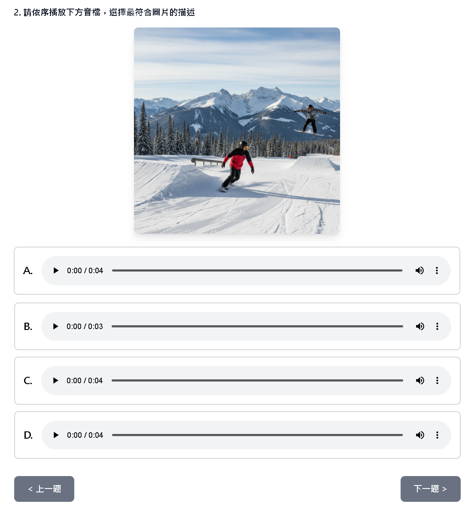
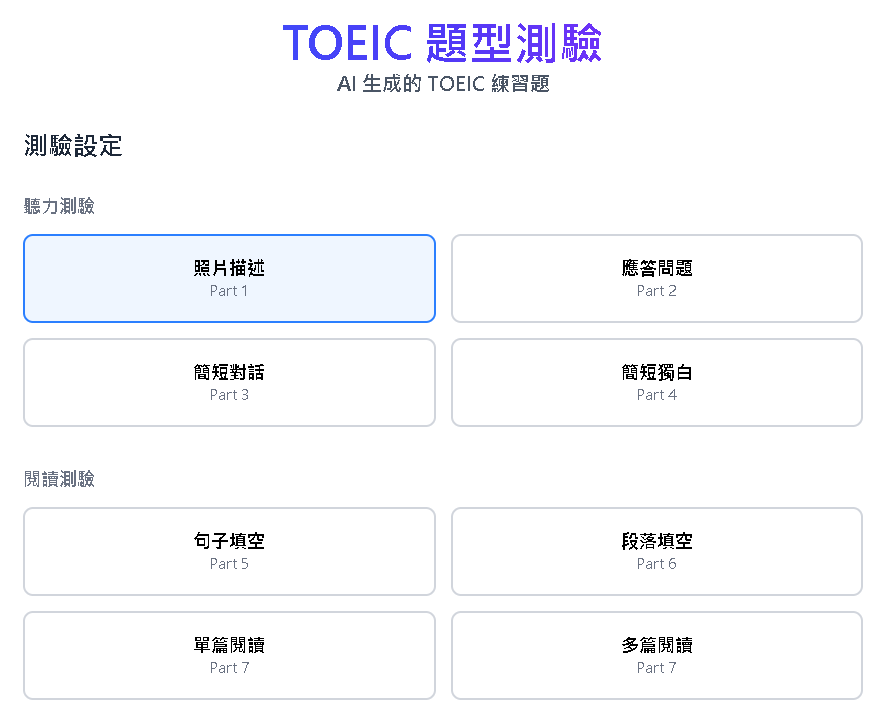
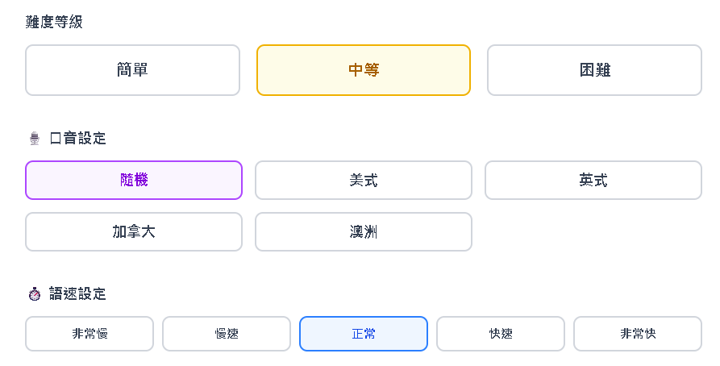
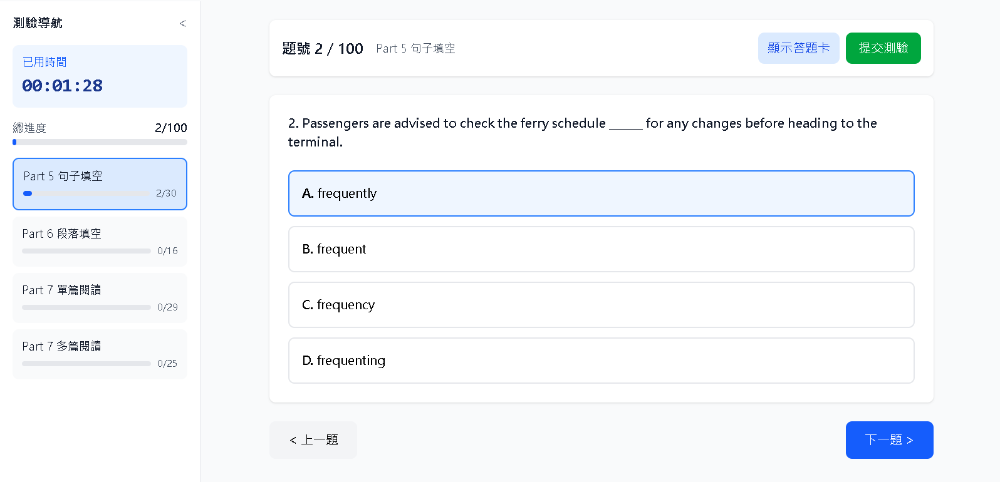
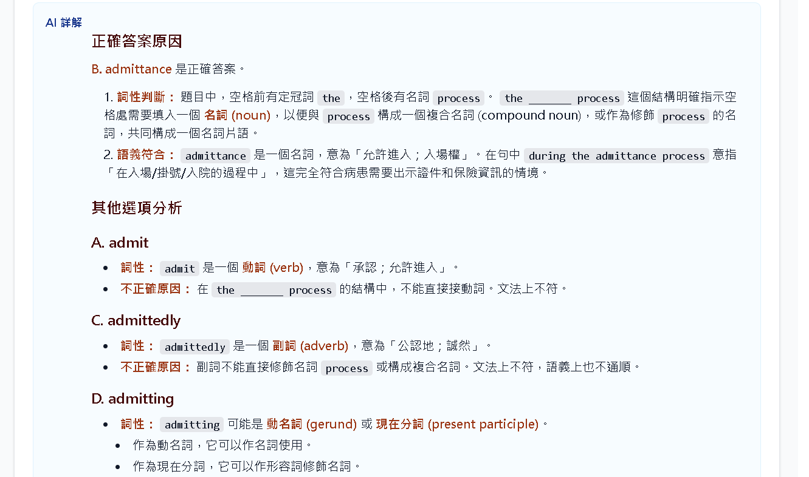
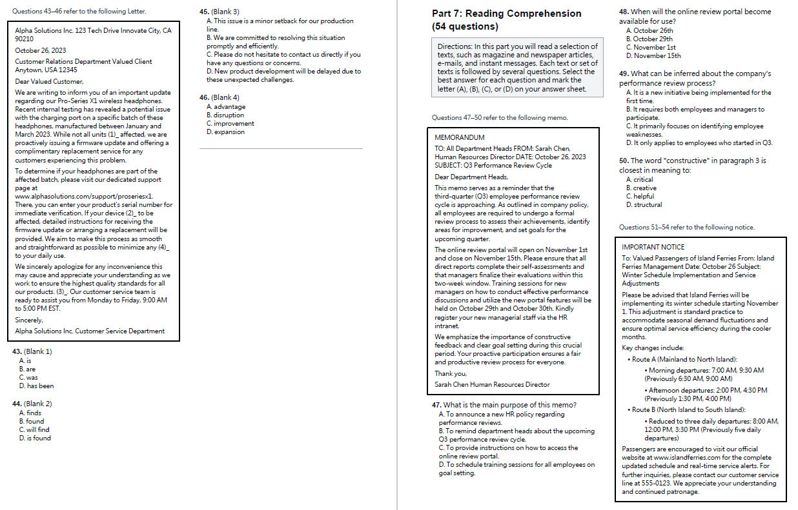

# TOEIC Quiz Generator

一套可以自己生成 TOEIC 練習題、作答、批改、看詳解、整理測驗紀錄的練習工具，適合想要大量練習 TOEIC 的各類題型、針對弱點加強訓練或建立個人化題庫的人使用。

## 功能特色

✅ **TOEIC Part 1-7 題型測驗**



| 可生成多種練習題型  | 支援口音與語速設定 |
|-------|-------|
|  |  |


✅ **完整模擬測驗**



✅ **AI 詳解與錯題檢討**




✅ **側邊欄歷史紀錄，讓你能隨時複習**


✅ **閱讀測驗匯出 PDF 題本，方便列印、保存或離線練習**



## 🚀 快速啟動說明

### Windows 用戶

#### 🔧 前置準備（必須）

第一次使用前，請先安裝以下工具。

### 1. 安裝 Python 3.11+

下載連結：<https://www.python.org/downloads/>

安裝時請勾選：

```text
Add Python to PATH
```

安裝完成後，重新開啟 PowerShell，輸入：

```powershell
python --version
```

看到 Python 版本即代表安裝成功。

### 2. 安裝 Node.js LTS

下載連結：<https://nodejs.org/>

建議下載 LTS（長期支援）版本。

安裝完成後，重新開啟 PowerShell，輸入：

```powershell
node --version
npm --version
```

看到版本號即代表安裝成功。

### 3. 安裝 uv（Python 套件管理工具）

開啟 PowerShell，執行：

```powershell
powershell -ExecutionPolicy ByPass -c "irm https://astral.sh/uv/install.ps1 | iex"
```

安裝完成後，重新開啟 PowerShell，輸入：

```powershell
uv --version
```

看到版本號即代表安裝成功。

### 4. 安裝 ffmpeg（必須）

ffmpeg 是聽力題音訊處理會用到的工具，必須安裝後才能完整使用 Part 1 / Part 2 的語音切割流程。

#### 方法 1：使用 Scoop 安裝（推薦）

開啟 PowerShell，先安裝 Scoop：

```powershell
Set-ExecutionPolicy -ExecutionPolicy RemoteSigned -Scope CurrentUser
Invoke-RestMethod -Uri https://get.scoop.sh | Invoke-Expression
```

確認 Scoop 安裝成功：

```powershell
scoop --version
```

接著安裝 ffmpeg：

```powershell
scoop install ffmpeg
```

確認 ffmpeg 安裝成功：

```powershell
ffmpeg -version
```

⚠️ 如果指令找不到，請重新開機後再試一次。

#### 方法 2：手動安裝

1. 前往 <https://www.gyan.dev/ffmpeg/builds/>
2. 下載 `ffmpeg-release-essentials.zip`
3. 解壓縮到固定位置，例如：

```text
C:\ffmpeg
```

4. 將下列路徑加入系統環境變數 `PATH`：

```text
C:\ffmpeg\bin
```

5. 重新開啟 PowerShell，輸入：

```powershell
ffmpeg -version
```

看到版本資訊即代表安裝成功。

### 下載專案

開啟 PowerShell，執行：

```powershell
git clone https://github.com/FlagTech/TOEIC_Quiz_Generator.git
cd TOEIC_Quiz_Generator
```

如果你的電腦沒有 Git，也可以在 GitHub 頁面點選：

```text
Code > Download ZIP
```

下載後解壓縮，再進入專案資料夾。

### 一鍵啟動

在專案資料夾中，直接執行：

```bat
setup_and_start.bat
```

啟動後開啟：

- 練習頁面：`http://localhost:5174`
- 後端服務：`http://localhost:8001`

第一次使用時，請到右上角「設定」頁面輸入 Gemini API Key。API Key 會儲存在你的瀏覽器中，下次開啟會自動帶入。

### 手動啟動（進階）

後端：

```bash
uv sync
uv run uvicorn backend.main:app --host 127.0.0.1 --port 8001 --reload
```

前端：

```bash
cd frontend
npm install
npm run dev
```

### 啟動成功後

請依照以下順序操作：

1. 開啟 `http://localhost:5174`
2. 點選右上角「設定」
3. 輸入 Gemini API Key
4. 回到題型測驗或模擬測驗頁面
5. 開始生成題目

### 常見啟動問題

- `python` 不是內部或外部命令：請重新安裝 Python，並勾選 `Add Python to PATH`。
- `node` 或 `npm` 找不到：請重新安裝 Node.js LTS。
- `uv` 找不到：請重新執行 uv 安裝指令，並重新開啟 PowerShell。
- `ffmpeg` 找不到：請確認 `ffmpeg -version` 可正常執行，必要時重新開機。
- 網頁打不開：確認後端與前端兩個視窗都有成功啟動。
- 生成失敗：確認 Gemini API Key 已在設定頁輸入，且 API 配額仍可使用。

## 使用流程

1. 開啟系統。
2. 到「設定」頁面輸入 Gemini API Key。
3. 選擇「題型測驗」或「模擬測驗」。
4. 生成題目並開始作答。
5. 提交後查看成績。
6. 需要時產生 AI 詳解。
7. 從側邊欄回到歷史紀錄，繼續複習或重新測驗。

## 使用提醒

- 聽力題會產生音檔，Part 1 會產生圖片，這些檔案會存在本機快取資料夾。
- 測驗紀錄與生成結果會存在本機資料庫，不會上傳到 GitHub。
- `ffmpeg` 是必須安裝項目，否則聽力題的音訊處理流程可能無法正常運作。
- API Key 由使用者自行提供，請留意 API 使用量與費用。

## 專案資料

本專案會在本機產生下列資料，這些資料已被 `.gitignore` 排除：

- 測驗資料庫
- 聽力音檔快取
- Part 1 圖片快取
- PDF 匯出檔案
- COCO caption 快取資料

## 開發指令

前端檢查與建置：

```bash
cd frontend
npm run type-check
npm run build
```

後端語法檢查：

```bash
python -m compileall backend
```

## 授權

本專案目前未附正式授權條款。若要公開散佈、二次開發或商用，請先補上授權與 API 使用政策說明。
